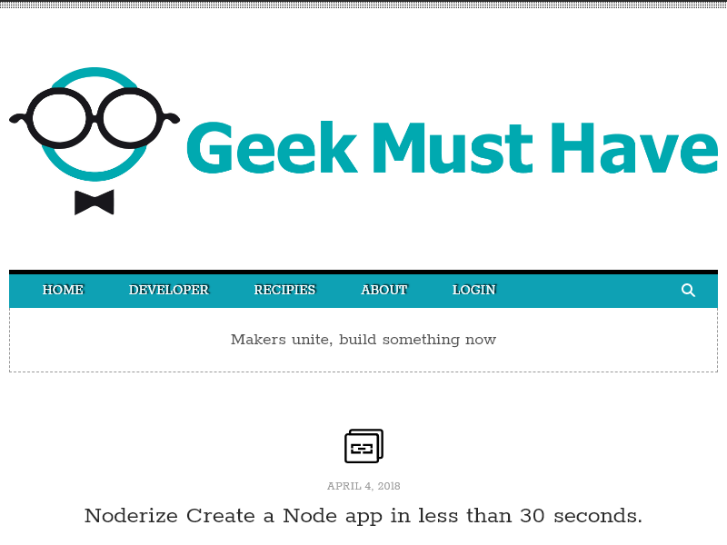

= Headless Browser experiments
John Schuster <John.schuster@mindspring.com>
V2.1d,04/04/2018:Research Notes
:Author: John HR Schuster
:Company: GeekMustHave
:toc: left
:toclevels: 4:
:imagesdir: ./images
:pagenums:
:experimental:
:source-hightlighter: pygments
:icons: font

A headless browser is a web browser without a graphical user interface.
Headless browsers provide automated control of a web page in an environment similar to popular web browsers, 
but are executed via a command-line interface or using network communication.

I plan to use the headless browser for the Camunda project.

This project is sourced in `~\Dropbox\MyDev\Headless\Browser`

The HTML version of this document is at https://geekmusthave.com/Courses/Headless-Browser/readme.html

The PDF version of this document is at https://geekmusthave.com/Courses/Headless-Browser/readme.pdf

== Bootstrap

There are quite a few headless browser opyions.
After some research I have selected the `puppeteer` package.

Reference: https://github.com/GoogleChrome/puppeteer

Puppeteer is a Node library which provides a high-level API to control headless Chrome or Chromium over the DevTools Protocol. 
It can also be configured to use full (non-headless) Chrome or Chromium.

=== Node Initilazion

This creates a Node `package.json` file used to configure the project.

  npm Init 

=== Install puppeteer  

In general, the rule of thumb is:

. If you’re installing something that you want to use in your program, 
using require('whatever'), then install it locally, at the root of your project.
. If you’re installing something that you want to use in your shell, 
on the command line or something, install it globally, so that its binaries end up in your PATH environment variable.  

I went with Option 1.

   npm install puppeteer

NOTE:  When you install Puppeteer, 
it downloads a recent version of Chromium 
(~170Mb Mac, ~282Mb Linux, ~280Mb Win) 
that is guaranteed to work with the API. To skip the download   

CAUTION: Remember to add `node_modules` to the `.gitignore` file!!

This added the following to the `package.json` file.

----
  "dependencies": {
    "puppeteer": "^1.2.0"
  }

----

== Example code 

The example code is based on the web site `GeekMustHave.com`, best website on the planet.
The example code uses ES6 syntax.

[source,javascript]
----
include::example.js[Code]
----

When this code is run there will be a pause just after the browser object is created.

The image below will not display in the PDF version of the documnet.

image::npmstart.gif[Run]

The Node app will create a file `example.png` which in this case looks like.

== GIT / GITHub 

I'm GitHub'ing everything.
This may seem like overkill here but, I'm trying to get a process for any development.
This will help in future projects.

=== .gitignore file

Create this file before you GIT anything.

.`.gitignore` file example for this project
----
node_modules <1>
.gitignore
----
<1> You dont need to the `node_modeles` libraries you can recreate

=== Create local GIT

Create GIT repository, add everything (except whats named in the `.gitignore` file), commit it.

.GIT initilization commands
[source,powershell]
----
git init
git add .
git commit -mFirst-One
----

Results are 

.GIT initilization results
[source,powershell]
----
PS F:\users\jschust2\Dropbox\myDev\HeadlessBrowser> git init
Initialized empty Git repository in F:/users/jschust2/Dropbox/myDev/HeadlessBrowser/.git/
PS F:\users\jschust2\Dropbox\myDev\HeadlessBrowser> git add .
warning: LF will be replaced by CRLF in package-lock.json.
The file will have its original line endings in your working directory.
warning: LF will be replaced by CRLF in package.json.
The file will have its original line endings in your working directory.
PS F:\users\jschust2\Dropbox\myDev\HeadlessBrowser>
PS F:\users\jschust2\Dropbox\myDev\HeadlessBrowser> git commit -mFirst-one
[master (root-commit) d327034] First-one
 7 files changed, 1045 insertions(+)
 create mode 100644 example.js
 create mode 100644 example.png
 create mode 100644 images/npmstart.gif
 create mode 100644 package-lock.json
 create mode 100644 package.json
 create mode 100644 readme.adoc
 create mode 100644 readme.html
PS F:\users\jschust2\Dropbox\myDev\HeadlessBrowser>
----

=== Create remote GitHub

Create a new repository on GitHub.

image::github.png[Remote]

Github will give you the commands to sync the local Git to the remote Git.

image::gitremote.png[Transfer]

=== Sync local to remote

.GIT remote setup
[source,javascript]
----
git remote add origin https://github.com/GeekMustHave/headless-browser.git
git push -u origin master
----

Which results in 

.GIT initial setup
[source,powershell]
----
PS F:\users\jschust2\Dropbox\myDev\HeadlessBrowser> git remote add origin https://github.com/GeekMustHave/headless-browser.git
PS F:\users\jschust2\Dropbox\myDev\HeadlessBrowser> git push -u origin master
Counting objects: 10, done.
Delta compression using up to 8 threads.
Compressing objects: 100% (9/9), done.
Writing objects: 100% (10/10), 2.72 MiB | 1.05 MiB/s, done.
Total 10 (delta 1), reused 0 (delta 0)
remote: Resolving deltas: 100% (1/1), done.
To https://github.com/GeekMustHave/headless-browser.git
 * [new branch]      master -> master
Branch 'master' set up to track remote branch 'master' from 'origin'.
PS F:\users\jschust2\Dropbox\myDev\HeadlessBrowser>
----

Now the GitHub will be loaded with the project and the `readme.adoc` 
file is used as the documentation for the repository.

image::readmeadoc.png[Documentation]

== Grunt 

This is also overkill for a small project.
Grunt is a task runner that can reduce development to deployment efforts.

In some documentation projects I have a `GenDoc.PS1` Powershell file to manage the toolchain  for publishing.
I'm thinking Grunt may serve as a better tool for this.

[quanta]
What is Grunt?::
In one word: *automation*. The less work you have to do when performing repetitive tasks like 
minification, compilation, unit testing, linting, etc, 
the easier your job becomes. 
After you've configured it through a Gruntfile, 
a task runner can do most of that mundane work for 
you—and your team—with basically zero effort.

=== Bootstrap

Before setting up Grunt ensure that your npm is up-to-date by running 

  npm update -g npm
  
==== Grunt CLI 

In order to get started, you'll want to install Grunt's command line interface 
(CLI) globally. 

This will put the grunt command in your system path, 
allowing it to be run from any directory.

Note that installing grunt-cli does not install the Grunt task runner! 
The job of the Grunt CLI is simple: run the version of Grunt which has been installed next to a Gruntfile. 
This allows multiple versions of Grunt to be installed on the same machine simultaneously.

.Install the GRUNT CLI
[source,powershell]
----
npm install -g grunt-cli
----

==== Enable Grunt in a Node app

`package.json`: This file is used by npm to store metadata for projects 
published as npm modules.
 You will list grunt and the Grunt plugins your project needs as 
 `devDependencies`` in this file.

`gruntfile`: This file is named `gruntfile.js`  and is used to configure or 
define tasks and load Grunt plugins. 
When this documentation mentions a Gruntfile it is talking about a file, 
which is a `Gruntfile.js`.

The easiest way to add Grunt and gruntplugins to an existing `package.json`
is with the command `npm install grunt --save-dev`. 
Not only will this install `grunt`` locally, 
but it will automatically be added to the `devDependencies` section, 
using a tilde version range.
 
.Command to install Grunt in app.
[source,powershell]
----
npm install grunt --save-dev
----

After this the `package.json` file will have a new section.

.package.json file (devolper dependencies)
[source,javascript]
----
  "devDependencies": {
    "grunt": "^1.0.2"
  }
----

==== Create a gruntfile.js

Every Gruntfile (and gruntplugin) uses this basic format, 
and all of your Grunt code must be specified inside this function:

.module wrapper
[source,javascript]
----
module.exports = function(grunt) {
  // Do grunt-related things in here
};
----

Most Grunt tasks rely on configuration data defined in an object passed to the `grunt.initConfig` method.

In this example, `grunt.file.readJSON('package.json')`` imports the JSON metadata stored in `package.json`
into the grunt config. 
Because <% %> template strings may reference any config properties, configuration data like filepaths and 
file lists may be specified this way to reduce repetition.

You may store any arbitrary data inside of the configuration object, 
and as long as it doesn't conflict with properties your tasks require, it will be otherwise ignored. 
Also, because this is JavaScript, you're not limited to JSON; you may use any valid JS here. 
You can even programmatically generate the configuration if necessary.

.Example of gruntfile.js 
[source,javascript]
----
module.exports = function(grunt) {
    grunt.initConfig({
        pkg: grunt.file.readJSON('package.json')
    });  

    // --- Other grunty stuff goes here
};
----

=== Grunt tasks

==== ASCIIDoctor

One of the things done in this project is the documentation which requires ASCIIDoctor.

One of the ways to handle the HTML generation is to install Ruby, GEM and the ASCIIDOCTOR GEM.
This is quite a bit of work if you have never done it before.

A Grunt plugin that uses Asciidoctor via Asciidoctor.js to process AsciiDoc 
source files within the project.  These files have the `*.ADOC` extension.

.Install Grunt ASCIIdoctor plug-n
[source,powershell]
----
npm install grunt-asciidoctor --save-dev
----

Now the `package.json` files dev dependancies section looks like

.package.json (Deloper Dependencies Section)
[source,javascript]
----

  "devDependencies": {
    "grunt": "^1.0.2",
    "grunt-asciidoctor": "^0.2.1"
  }
----

Add the `grunt-asciidoctor` to the `gruntfile.js`

.gruntfile.js file
[source,javascript]
----
module.exports = function(grunt) {
    grunt.initConfig({
        pkg: grunt.file.readJSON('package.json')
    });  

    // --- Other Grunty stuff goes here

    // --- Load ASCIIDoctor plugin here
    grunt.loadNpmTasks('grunt-asciidoctor'); <1>
};
----
<1> Load the plug in to be used, not cofigured yet

